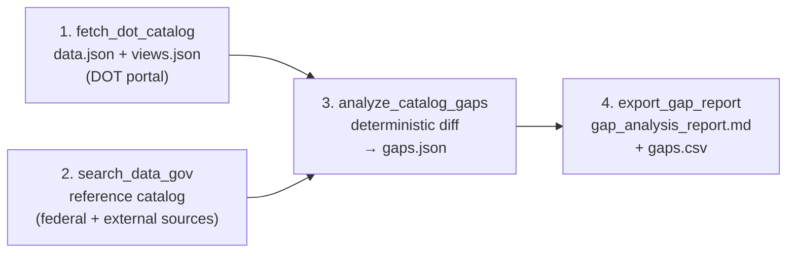

# DOT Data Gap Research Agent

**Agentic BI trust layer for transportation open data** — deterministic Python catalog diff first, LLM synthesis second. Built for [data.transportation.gov](https://data.transportation.gov) gap research; same audit pattern as production QC tooling (validate → rank → draft action → human review).

The CLI pipeline catalogs the DOT Socrata portal, compares it against federal and third-party reference sources, and produces **evidence-backed** gap reports with `priority_score`, `gap_class`, and `recommended_action` on every row.

**Full reference-catalog documentation:** [docs/reference-catalog.md](docs/reference-catalog.md)

## Pipeline at a Glance



## Quick Start

### Prerequisites

- **Python 3.11+** (required for LLM agent path)
- **NVIDIA API key** — [build.nvidia.com](https://build.nvidia.com) (LLM agent only)
- **Tavily API key** (optional) — [tavily.com](https://tavily.com)
- **Node.js 18+** (optional, for React UI only)

### 1. Install

```powershell
python -m venv .venv
.venv\Scripts\activate          # Windows
# source .venv/bin/activate     # macOS/Linux
pip install -r backend/requirements.txt
```

Copy environment variables:

```powershell
cp .env.example backend/.env
# Edit backend/.env — set DATAGOV_API_KEY for full catalog.data.gov coverage
```

### 2. CLI — Smoke test (full pipeline, no LLM)

Runs the full 4-step pipeline without API keys:

```powershell
python cli/smoke_test_tools.py

# With popularity rankings (slower — fetches per-dataset view/download counts)
python cli/smoke_test_tools.py --with-popularity --popularity-limit 200

# Optional link health checks on top true gaps
python cli/smoke_test_tools.py --check-links
```

Outputs:

| File | Description |
|------|-------------|
| `backend/workspace/data/dot_catalog_snapshot.json` | Merged `data.json` + `views.json` |
| `backend/workspace/data/reference_catalog.json` | data.gov + external registries |
| `backend/workspace/data/gaps.json` | Structured gap findings (with `gap_class`, `evidence`) |
| `backend/workspace/data/gaps.csv` | Flat export: `priority_score`, `primary_category`, `provider` |
| `backend/workspace/reports/gap_analysis_report.md` | Human-readable report (true gaps, provider rollup) |
| `backend/workspace/data/popularity_rankings.json` | Top datasets per category (with `--with-popularity`) |
| `backend/workspace/reports/popular_datasets_by_category.md` | Popularity report (with `--with-popularity`) |

### 3. CLI — LLM agent (optional)

Requires `deepagents` and `NVIDIA_API_KEY`:

```powershell
python cli/run_gap_analysis.py
```

If `deepagents` fails to install, use `interview_demo.py` or `smoke_test_tools.py` — they cover the same deterministic catalog and gap logic.


## Pipeline

```
1. fetch_dot_catalog     →  data.json + views.json (DOT portal)
2. search_data_gov       →  reference catalog (federal + external sources)
3. analyze_catalog_gaps  →  deterministic diff → gaps.json
4. export_gap_report     →  gap_analysis_report.md
```

## Custom Tools

| Tool | Purpose |
|------|---------|
| `fetch_dot_catalog` | Download `data.json` and enrich via native `views.json` |
| `search_data_gov` | Merge catalog.data.gov with external registries and cross-portal discovery |
| `analyze_catalog_gaps` | Deterministic diff: missing, stale, no API, empty categories |
| `export_gap_report` | Write markdown report to `workspace/reports/` |

## Reference Catalog Sources

Configured in `data/reference/external_catalogs.yaml` and documented in [docs/reference-catalog.md](docs/reference-catalog.md).

| Layer | Examples | Typical count |
|-------|----------|---------------|
| **Registry fetchers** (live) | MobilityData GBFS, OMF MDS, WZDx feeds, Transitland Atlas US | ~476 |
| **Static portals** | RITIS/NPMRDS, ATSPM, MIRE, ICPSR, state DOT portals | 25 |
| **Clearinghouses** | Transitland, MobilityData, OMF, SharedStreets, GMNS | 6 |
| **ArcGIS hubs** | USDOT NTAD, BTS geodata | ~99 |
| **API endpoints** | NHTSA vPIC, FMCSA QCMobile, FRA GCIS OData | 7 |
| **Socrata Discovery** | Cross-portal DOT-related datasets | ~2,400 |
| **catalog.data.gov** | Federal DOT org slug `dot` | varies (needs API key) |

### Registry fetchers

Pulled automatically at runtime:

- **MobilityData GBFS** — US micromobility systems from `systems.csv`
- **OMF MDS** — shared-mobility providers from `providers.csv`
- **WZDx** — jurisdiction work-zone API endpoints from DOT portal CSV
- **Transitland Atlas** — US GTFS/GBFS feeds from GitHub DMFR files

### Intentional external hosting

Probe data (RITIS/NPMRDS), ATSPM, MIRE inventories, micromobility registries, and distributed transit feeds are often **not** meant to live on data.transportation.gov. The gap report flags them as `missing_on_portal` for visibility — see [docs/reference-catalog.md#intentional-gaps-research-findings](docs/reference-catalog.md#intentional-gaps-research-findings).

## Gap Status Types

- **missing_on_portal** — In reference catalog but not matched on data.transportation.gov
  - **gap_class: true_gap** — Federal/cross-portal datasets that could be mirrored on the portal
  - **gap_class: intentional_external** — Partner portals, registries, restricted-access systems (link-only)
- **category_empty** — Portal category has zero datasets
- **stale_metadata** — No update in 2+ years
- **no_api_endpoint** — No Socrata/API access path
- **redirect_only** — Links externally without hosted data

## v2 Features

- **Trust-layer outputs** — `evidence`, `recommended_action`, `priority_score` on every gap row
- **Single primary category** — `primary_category()` fixes over-tagging and double-count in rollups
- **Canonical categories** — [`category_taxonomy.yaml`](data/reference/category_taxonomy.yaml) normalizes Socrata `"and"` vs `"&"` labels (12 buckets instead of 19+)
- **Provider rollup** — [`provider_aliases.yaml`](data/reference/provider_aliases.yaml) + **Issues by Provider** report section
- **Asset types** — `api_dataset`, `downloadable_data`, `portal_link`, `third_party_redirect`, etc.
- **Popularity rankings** — `--with-popularity` enriches datasets via `/api/views/{uid}.json` (`viewCount`, `downloadCount`)
- **Split gap report** — True gaps (priority-sorted) vs intentionally external sources
- **Duplicate detection** — fuzzy title clusters ≥90% in `dedup.py`
- **Optional link health** — `--check-links` HEAD-checks top true-gap URLs
- **Interview protocol** — [docs/category-research-protocol.md](docs/category-research-protocol.md) for validating taxonomy with dataset users

## Reference Data

- `data/reference/expected_topics.yaml` — keyword fallbacks for uncategorized datasets
- `data/reference/category_taxonomy.yaml` — canonical portal categories and Socrata aliases
- `data/reference/modal_agencies.yaml` — FAA, FHWA, FRA, FTA, NHTSA, etc.
- `data/reference/provider_aliases.yaml` — organization string → provider short name
- `data/reference/provider_verification.yaml` — Nova Toe checklist (NTD, DataQs, HSIS)

- `data/reference/external_catalogs.yaml` — supplemental portals, APIs, registries, and fetcher config

## Architecture

```
CLI (interview_demo.py / smoke_test_tools.py)  →  tools/ directly (no LLM)
                                                    ├── gap_analysis.py (diff + evidence)
                                                    ├── gap_scoring.py (priority_score)
                                                    ├── dedup.py, link_health.py (optional)
                                                    └── workspace/ (gaps.csv + reports)

React UI (optional workshop)  →  FastAPI (server.py)  →  agent.py (create_deep_agent)
```

## Environment Variables

| Variable | Required | Description |
|----------|----------|-------------|
| `NVIDIA_API_KEY` | LLM agent only | NVIDIA NIM model access |
| `TAVILY_API_KEY` | No | Web search for cross-portal discovery |
| `DATAGOV_API_KEY` | No | [api.data.gov](https://api.data.gov/signup/) key; defaults to `DEMO_KEY` (strict rate limits) |
| `DOT_AGENT_WORKSPACE` | No | Override workspace path (default: `backend/workspace`) |

## License

Derived from the NVIDIA Build An Agent Workshop demo. See workshop repo for upstream licensing.
