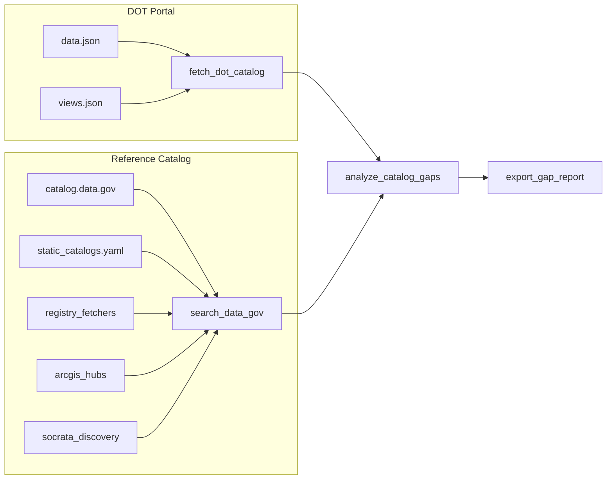

# Reference Catalog & External Sources

This document describes how the DOT Data Gap Research Agent builds its **reference catalog** — the set of public transportation datasets and APIs used to find gaps on [data.transportation.gov](https://data.transportation.gov).

Configuration lives in [`data/reference/external_catalogs.yaml`](../data/reference/external_catalogs.yaml). Runtime fetch logic is in [`backend/tools/external_catalogs.py`](../backend/tools/external_catalogs.py).

## Pipeline overview



### Step 1 — DOT portal catalog (`fetch_dot_catalog`)

| Source | URL | Role |
|--------|-----|------|
| DCAT `data.json` | `https://data.transportation.gov/data.json` | Primary dataset metadata |
| Socrata `views.json` | `https://data.transportation.gov/api/views.json` | Enriches rows with API endpoints, update dates, and portal-only assets |

The global Socrata Discovery API with `domains=data.transportation.gov` returns only a handful of results and is **not** used for full portal coverage. Native `views.json` is the reliable enrichment path.

### Step 2 — Reference catalog (`search_data_gov`)

Sources are merged in this order:

1. **catalog.data.gov** — org slug `dot` via [api.gsa.gov](https://api.gsa.gov/technology/datagov/v4/search) (set `DATAGOV_API_KEY` in `.env`; `DEMO_KEY` rate-limits quickly)
2. **Static catalogs** — portals, APIs, clearinghouses, and commercial standards from YAML
3. **Registry fetchers** — live CSV/JSON registries (see below)
4. **ArcGIS hubs** — USDOT NTAD and BTS geodata catalogs
5. **Socrata Discovery** — cross-portal queries for DOT-related datasets on other `.gov` Socrata sites
6. **Fallback** — if all above are empty, a broader cross-portal Socrata sweep runs

Output: `backend/workspace/data/reference_catalog.json`

### Step 3 — Gap analysis (`analyze_catalog_gaps`)

Deterministic diff between DOT portal and reference catalog. Matches on identifier, landing page URL, and fuzzy title (≥85%). See [Gap status types](#gap-status-types) in the README.

### Step 4 — Report (`export_gap_report`)

Markdown report at `backend/workspace/reports/gap_analysis_report.md`.

## `external_catalogs.yaml` sections

| Section | Fetched at runtime? | Purpose |
|---------|---------------------|---------|
| `registry_fetchers` | Yes | Machine-readable registries (CSV, DMFR JSON) |
| `arcgis_hubs` | Yes | Paginated ArcGIS Open Data Hub v3 API |
| `socrata_discovery_queries` | Yes | Cross-portal Socrata Discovery searches |
| `portals` | Static | Known agency portals and documentation sites |
| `api_endpoints` | Static | Documented public APIs |
| `clearinghouses` | Static | Third-party aggregators (Transitland, MobilityData, OMF, etc.) |
| `standards_registries` | Static | Specs and commercial probe-data vendors |

## Registry fetchers (live)

These are pulled on every `search_data_gov` / smoke-test run.

### MobilityData GBFS (`mobilitydata_gbfs`)

- **URL:** `https://raw.githubusercontent.com/MobilityData/gbfs/master/systems.csv`
- **Filter:** US only (`Country Code = US`)
- **Typical count:** ~175 systems
- **Gap signal:** Micromobility GBFS feeds are rarely indexed as datasets on data.transportation.gov

### OMF MDS providers (`omf_mds_providers`)

- **URL:** `https://raw.githubusercontent.com/openmobilityfoundation/mobility-data-specification/main/providers.csv`
- **Typical count:** ~76 providers
- **Gap signal:** Shared-mobility operator APIs live outside the DOT portal

### WZDx feed registry (`wzdx_feed_registry`)

- **URL:** `https://data.transportation.gov/api/views/69qe-yiui/rows.csv`
- **Fields:** `feedName`, `url`, jurisdiction metadata
- **Typical count:** ~39 jurisdiction feeds
- **Gap signal:** Registry metadata may appear on the portal, but operational work-zone **API endpoints** are external per-state/local feeds

### Transitland Atlas US (`transitland_atlas_us`)

- **Source:** GitHub `transitland/transitland-atlas` → `feeds/*.dmfr.json`
- **Filter:** Excludes non-US domain patterns (`.ca.`, `.com.au.`, etc.); samples up to 40 DMFR files
- **Typical count:** ~186 GTFS/GBFS feed entries
- **Gap signal:** Transit feeds are aggregated by Transitland, not mirrored on data.transportation.gov

## Static portals (25 entries)

Agency and program sites intentionally hosting data outside the Socrata portal:

| ID | Name | Access | Notes |
|----|------|--------|-------|
| `ritis_npmrds` | RITIS / NPMRDS Analytics Platform | Agreement required | FHWA probe-speed archive |
| `ritis_platform` | RITIS | Sponsorship required | Incidents, weather, probe, signals |
| `virginia_rm3p_dep` | Virginia RM3P Data-Exchange Platform | Permissioned | Regional multi-agency API hub |
| `fhwa_mire` | FHWA MIRE Roadway Inventory Standard | Public docs | Inventories live in state GIS |
| `fhwa_npmrds_program` | FHWA NPMRDS Program Documentation | Public | NPMRDS program reference |
| `fhwa_wzdx` | FHWA Work Zone Data Exchange | Public | WZDx spec and program |
| `udot_atspm` | UDOT ATSPM | Public / per-agency | Open-source signal performance; data stored locally |
| `ohio_tims` | Ohio DOT TIMS | Public | State transportation GIS |
| `oregon_dot_ritis` | Oregon DOT RITIS Integration | Public | State RITIS connection |
| `icpsr_mtbs` | ICPSR Metropolitan Travel Behavior Surveys | Public | Academic survey archive |
| `mtsa_surveyarchive` | Metropolitan Travel Survey Archive | Public | BTS-linked surveys |
| `dot_utc_program` | DOT University Transportation Centers | Public | UTC research programs |
| `ntl_rosap` | National Transportation Library (ROSA P) | Public | Reports and collections |
| `bts_ntad` | NTAD | Public | Also on ArcGIS hub |
| `fra_dataportal` | FRA Data Portal | Public | GCIS, grade crossings |
| `fra_safety_odata` | FRA Office of Safety OData | Registration | Token-based safety API |
| `faa_data_portal` | FAA Data Portal | Public | SWIM, aeronautical APIs |
| `nhtsa_datasets` | NHTSA Datasets and APIs | Public | Crash, recalls, FARS |
| `fmcsa_datasets` | FMCSA Datasets and APIs | Public | Carrier safety |
| `fhwa_policy_data` | FHWA Policy Information | Public | Highway statistics |
| `fta_ntd` | FTA National Transit Database | Public | NTD program |
| `phmsa_data` | PHMSA Data and Statistics | Public | Pipeline / HAZMAT |
| `marad_data` | MARAD Data and Reports | Public | Maritime |
| `dot_developer` | DOT Developer Resources | Public | Cross-modal API index |
| `dot_open_gov_inventory` | DOT Open Government Inventory | Public | Federal inventory |

## Clearinghouses (6 entries)

| ID | Organization | URL |
|----|--------------|-----|
| `transitland` | Interline / Transitland | https://transit.land |
| `mobilitydata` | MobilityData | https://mobilitydata.org |
| `open_mobility_foundation` | OMF | https://openmobilityfoundation.org |
| `dmfr_spec` | Transitland DMFR spec | https://github.com/transitland/distributed-mobility-feed-registry |
| `sharedstreets` | SharedStreets | https://sharedstreets.io/toolkit/ |
| `gmns_spec` | GMNS (Zephyr) | https://zephyr-data-specs.github.io/GMNS/ |

## Commercial / standards registries (3 entries)

Documented for gap context — probe and traffic data sold commercially, not on the open DOT portal:

- INRIX (`inrix_commercial`)
- TomTom Traffic (`tomtom_traffic`)
- HERE Probe Data (`here_probe`)

## ArcGIS hubs (2 catalogs)

| Hub | API | Typical datasets |
|-----|-----|------------------|
| USDOT Open Data | `data-usdot.opendata.arcgis.com/api/v3/datasets` | ~99 NTAD layers |
| BTS Geodata | `geodata.bts.gov/api/v3/datasets` | Geospatial NTAD services |

## API endpoints (7 documented)

| ID | Service |
|----|---------|
| `nhtsa_vpic` | NHTSA vPIC Vehicle API |
| `nhtsa_recalls_api` | NHTSA Recalls API |
| `fmcsa_qcmobile` | FMCSA QCMobile (API key) |
| `fra_gcis_odata` | FRA GCIS OData (registration) |
| `socrata_dev_docs` | Socrata API docs for DOT portal |
| `socrata_discovery_api` | Cross-portal Discovery API |
| `dot_views_json` | Native portal catalog (`views.json`) |

## Socrata Discovery queries (15)

Cross-portal search terms include modal agencies, NTAD, grade crossings, NTD, ATSPM, probe speed, and micromobility GBFS. Results exclude `data.transportation.gov` to avoid duplicating the portal catalog.

## Adding a new source

### Static portal or API

Add an entry under `portals`, `api_endpoints`, `clearinghouses`, or `standards_registries` in `external_catalogs.yaml`. No code change required.

### CSV registry

Add under `registry_fetchers` with:

```yaml
- id: my_registry
  name: My Registry
  url: https://example.com/registry.csv
  bureau: Agency
  modal: Roadways & Bridges
  format: csv
  title_field: name_column
  url_field: url_column
  id_field: id_column
  country_filter: US   # optional
```

### Custom fetcher

For non-CSV formats, extend `fetch_registry_fetchers()` in `external_catalogs.py` with a new `format` branch (see `dmfr_json` for Transitland).

## Smoke test (no LLM required)

```powershell
cd backend
.venv\Scripts\activate
python ..\cli\smoke_test_tools.py
```

Example output:

```
2. Fetching reference catalog (data.gov + external registries)...
   OK: 3068 datasets via static_catalogs (41) + registry_fetchers (476) + ...
       registry:transitland_atlas_us: 186
       registry:mobilitydata_gbfs: 175
       registry:omf_mds_providers: 76
       registry:wzdx_feed_registry: 39
```

```powershell
cd backend
.venv\Scripts\activate
python ..\cli\smoke_test_tools.py

# v2: popularity + canonical categories
python ..\cli\smoke_test_tools.py --with-popularity --popularity-limit 200
```

## v2: Categories, popularity, and gap classes

### Canonical category taxonomy

[`category_taxonomy.yaml`](../data/reference/category_taxonomy.yaml) maps Socrata labels like `"Roadways and Bridges"` to the homepage canonical name `"Roadways & Bridges"`. Implemented in [`backend/tools/category_taxonomy.py`](../backend/tools/category_taxonomy.py).

Gap reports should show **~12 category rows**, not 19+ duplicate `and`/`&` variants.

### Popularity rankings

[`backend/tools/popularity.py`](../backend/tools/popularity.py) fetches per-asset metrics:

- `GET https://data.transportation.gov/api/views/{uid}.json` → `viewCount`, `downloadCount`
- Outputs `workspace/data/popularity_rankings.json` and `workspace/reports/popular_datasets_by_category.md`

Use `--with-popularity` on the smoke test CLI. Default limit is 200 datasets to balance runtime vs. coverage.

### Gap classes

`gaps.json` entries with `status: missing_on_portal` include `gap_class`:

| Class | Sources | Report section |
|-------|---------|----------------|
| `true_gap` | catalog.data.gov, Socrata cross-portal, ArcGIS hubs | **True Gaps** |
| `intentional_external` | external_catalogs.yaml, registry fetchers | **Intentionally External Sources** |

### User interview protocol

See [category-research-protocol.md](category-research-protocol.md) for multi-round taxonomy validation with DOT stewards, researchers, and API developers.

## Intentional gaps (research findings)

Many transportation datasets are **by design** outside data.transportation.gov:

| Topic | Where it lives | Why not on portal |
|-------|----------------|-------------------|
| NPMRDS / probe speeds | [RITIS](https://npmrds.ritis.org/) | Data-sharing agreement required |
| ATSPM signal data | Agency-local (e.g. UDOT open-source) | No national aggregation |
| MIRE inventories | State DOT GIS | Standard only at FHWA |
| Micromobility | MobilityData GBFS, OMF MDS | Operator/regulator feeds |
| Transit GTFS | Transitland Atlas | Distributed feed registry |
| Work zones (live) | Per-jurisdiction WZDx APIs | Registry on portal; feeds external |
| Academic surveys | ICPSR, surveyarchive.org | Research archives |
| Commercial probe | INRIX, TomTom, HERE | Licensed products |

The gap analysis tags these as `gap_class: intentional_external` when they appear in the reference catalog — they are documented for visibility, not prioritized as portal mirrors.
